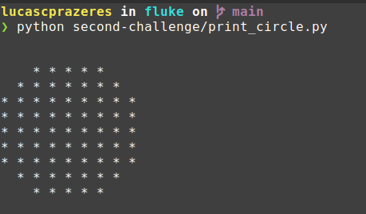

# Exercício 2

## Proposta

Criar uma função que receba um valor inteiro entre 1 e 100 e imprima um círculo
cujo raio de caracteres é o valor inserido, no terminal de execução.

## Lógica desenvolvida

Sabendo que as entradas são restritas a valores inteiros no intervalo dado, a primeira
coisa a ser feita é validar as entradas, que se não estiverem de acordo com o que é pedido,
farão com que a função imprima uma mensagem de "entrada inválida" e encerrarão a execução do programa. Em seguida, é criada uma variável de diâmetro para evitar operar sobre o raio diversas vezes.

A lógica principal encontra-se nos loops que vem em sequência, que iteram do valor 1 ao valor do diâmetro, tanto loop no externo, quanto no interno. Isso é bem semelhante a percorrer uma matriz quadrada, da esquerda para a direita, de cima para baixo. Em cada execução, a função checa se a "casa" visitada pertence ao círculo ou não, utilizando a equação geral da circuferência:

*R² = (x-xc)² + (y-yc)²*

De forma simplificada, utilizamos as posições de *x* e de *y* que se pretende analisar, bem como
os valores correspondentes ao centro da circuferência (*xc* e *yc*), do lado direito da equação. Se esse valor for menor ou igual ao quadrado do raio (lado esquerdo), então nosso ponto encontra-se dentro do círculo. Esse teste é feito em cada posição e, caso ela pertença ao círculo, imprime-se um "*", caso contrário, imprime-se um espaço vazio.

Ao final da iteração, temos um círculo gerado com os pontos que passaram no teste.

 

<small>
Resultado com o valor de entrada 5
<small>

